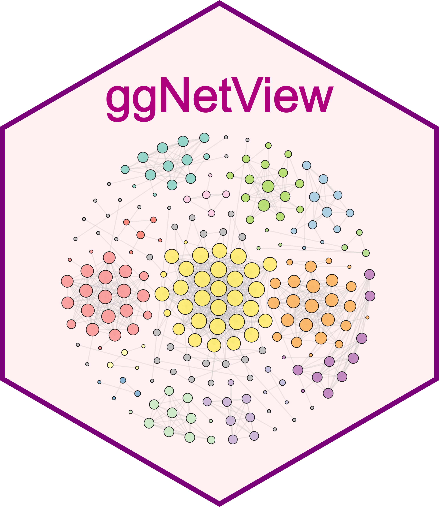
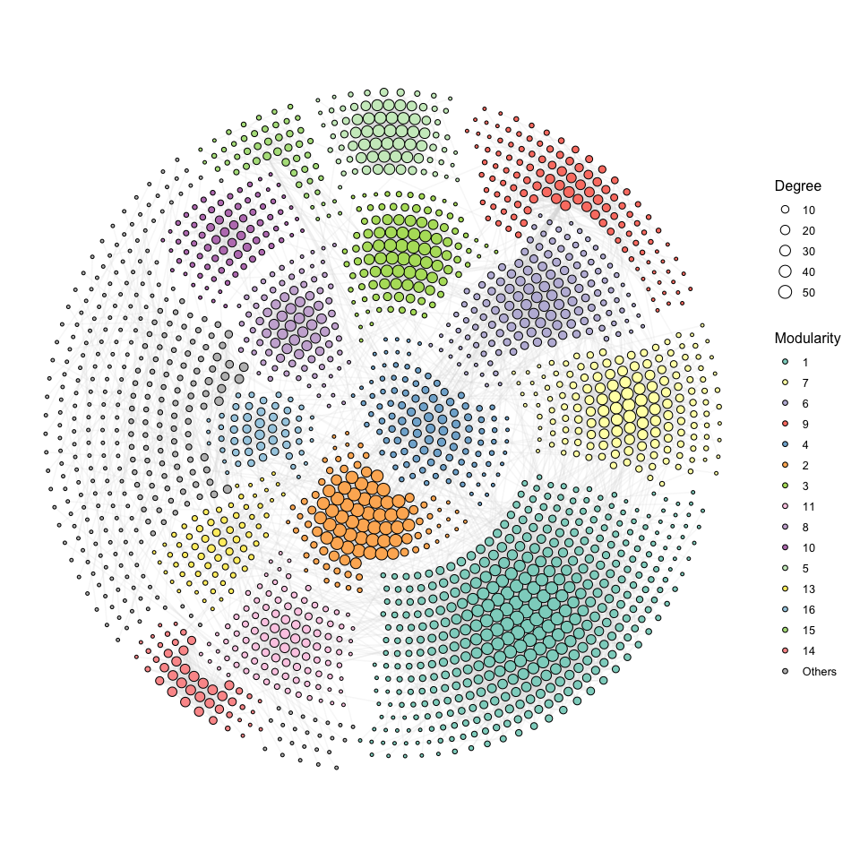

<!-- README.md is generated from README.Rmd. Please edit that file -->

# ggNetView 

<!-- badges: start -->

<!-- badges: end -->

ggNetView is an R package for network analysis and visualization. It
provides flexible and publication-ready tools for exploring complex
biological and ecological networks.

</br> </br> </br>

## Installation

You can install the development version of ggNetView from
[GitHub](https://github.com/) with:

    # install.packages("devtools")
    devtools::install_github("Jiawang1209/ggNetView")

or

    # install.packages("pak")
    pak::pak("Jiawang1209/ggNetView")

## Example

### Step1: load ggNetView

``` r
library(ggNetView)
```

### Step2: load Data

> You can load raw matrix

``` r
data("otu_tab")

otu_tab[1:5, 1:5]
#>        KO1  KO2  KO3  KO4  KO5
#> ASV_1 1113 1968  816 1372 1062
#> ASV_2 1922 1227 2355 2218 2885
#> ASV_3  568  460  899  902 1226
#> ASV_4 1433  400  535  759 1287
#> ASV_6  882  673  819  888 1475
```

> You can load rarely matrix

``` r
data("otu_rare")

otu_tab[1:5, 1:5]
#>        KO1  KO2  KO3  KO4  KO5
#> ASV_1 1113 1968  816 1372 1062
#> ASV_2 1922 1227 2355 2218 2885
#> ASV_3  568  460  899  902 1226
#> ASV_4 1433  400  535  759 1287
#> ASV_6  882  673  819  888 1475
```

> 

``` r
data("otu_rare_relative")

otu_rare_relative[1:5, 1:5]
#>              KO1        KO2        KO3        KO4        KO5
#> ASV_1 0.03306667 0.05453333 0.02013333 0.03613333 0.02686667
#> ASV_2 0.05750000 0.03393333 0.06046667 0.05810000 0.07320000
#> ASV_3 0.01733333 0.01296667 0.02290000 0.02336667 0.03106667
#> ASV_4 0.04266667 0.01093333 0.01416667 0.01933333 0.03346667
#> ASV_6 0.02646667 0.01856667 0.02110000 0.02353333 0.03806667
```

> You can load node annotation

``` r
data("tax_tab")

tax_tab[1:5, 1:5]
#>    OTUID  Kingdom          Phylum          Class             Order
#> 1  ASV_2  Archaea  Thaumarchaeota     Unassigned Nitrososphaerales
#> 2  ASV_3 Bacteria Verrucomicrobia Spartobacteria        Unassigned
#> 3 ASV_31 Bacteria  Actinobacteria Actinobacteria   Actinomycetales
#> 4 ASV_27  Archaea  Thaumarchaeota     Unassigned Nitrososphaerales
#> 5  ASV_9 Bacteria      Unassigned     Unassigned        Unassigned
```

### Step3: create graph object

``` r
obj <- build_graph_from_mat(
  mat = otu_rare_relative,
  transfrom.method = "none",
  method = "WGCNA",
  cor.method = "pearson",
  proc = "BH",
  r.threshold = 0.7,
  p.threshold = 0.05,
  node_annotation = tax_tab
)
#> 
```

### Step4: ggNetView to plot

``` r
p1 <- ggNetView(
  graph_obj = obj,
  layout = "gephi",
  layout.module = "adjacent",
  group.by = "Modularity",
  pointsize = c(1, 5),
  center = F,
  jitter = F,
  mapping_line = F,
  shrink = 0.9,
  linealpha = 0.2,
  linecolor = "#d9d9d9"
) 
#> Coordinate system already present.
#> ℹ Adding new coordinate system, which will replace the existing one.
#> Scale for fill is already present.
#> Adding another scale for fill, which will replace the existing scale.

p1
```



``` r
p2 <- ggNetView(
  graph_obj = obj,
  layout = "gephi",
  layout.module = "random",
  group.by = "Modularity",
  pointsize = c(1, 5),
  center = F,
  jitter = TRUE,
  jitter_sd = 0.15,
  mapping_line = TRUE,
  shrink = 0.9,
  linealpha = 0.2,
  linecolor = "#d9d9d9",
  add_outer = T,
  label = T
) 
#> Coordinate system already present.
#> ℹ Adding new coordinate system, which will replace the existing one.
#> Scale for fill is already present.
#> Adding another scale for fill, which will replace the existing scale.
#> Large array (1000 rows x 1001 columns x 17 images) broken into 4 pieces to avoid memory limits
#> 
#> Each piece of the raster consists of 708 rows and 708 columns
#> 
#> Coordinate system already present.
#> ℹ Adding new coordinate system, which will replace the existing one.

p2
#> Warning: No shared levels found between `names(values)` of the manual scale and the
#> data's fill values.
```


### Step5: save plot

    ggsave(file = "Output/p1.pdf",
           plot = p1,
           height = 10,
           width = 10)


    ggsave(file = "Output/p2.pdf",
           plot = p2,
           height = 10,
           width = 10)

#### Citation

If you use ggNetView in your research, please cite:

    Yue Liu (2025). ggNetView: An R package for complex biological and ecological network analysis and visualization. R package version 0.1.0. 
    https://github.com/Jiawang1209/ggNetView

<h4 align="center">

©微信公众号 RPython
</h5>
