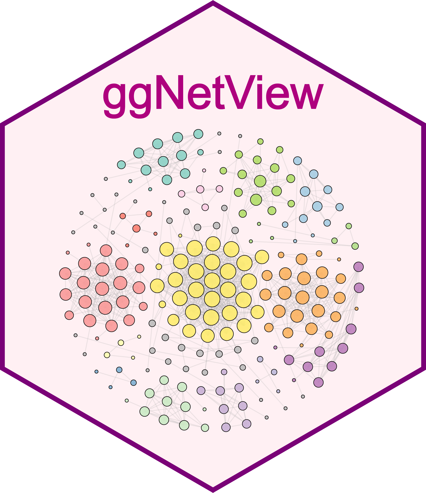
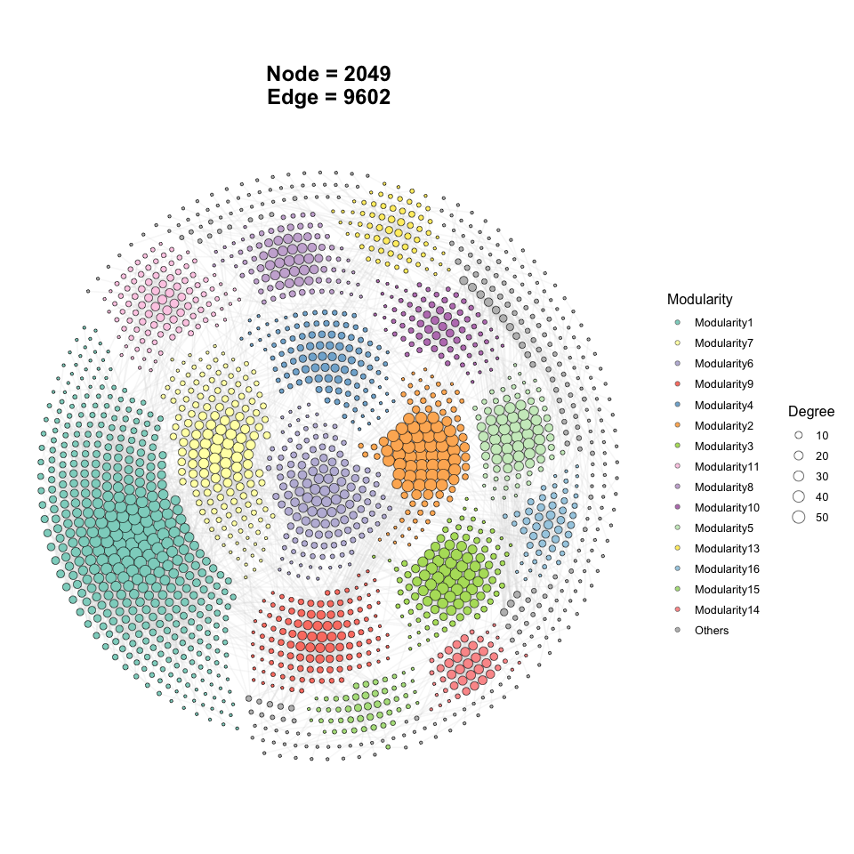
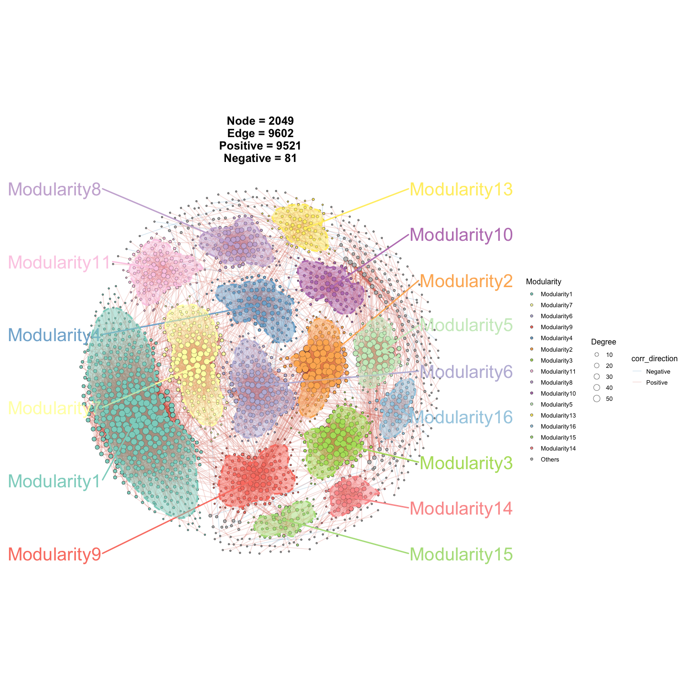
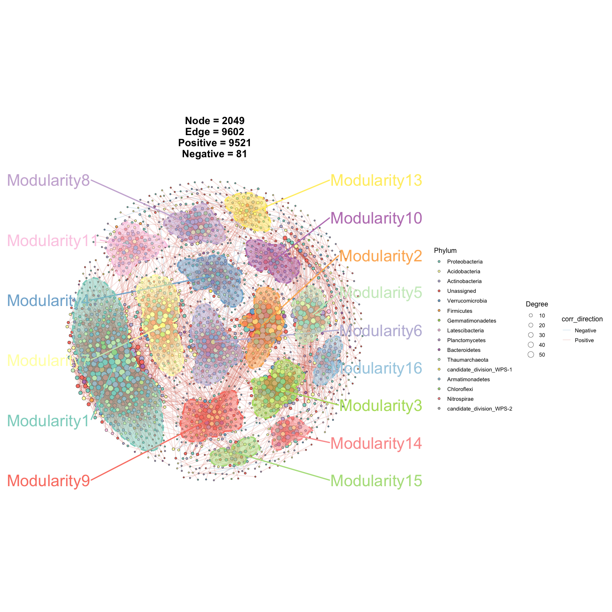
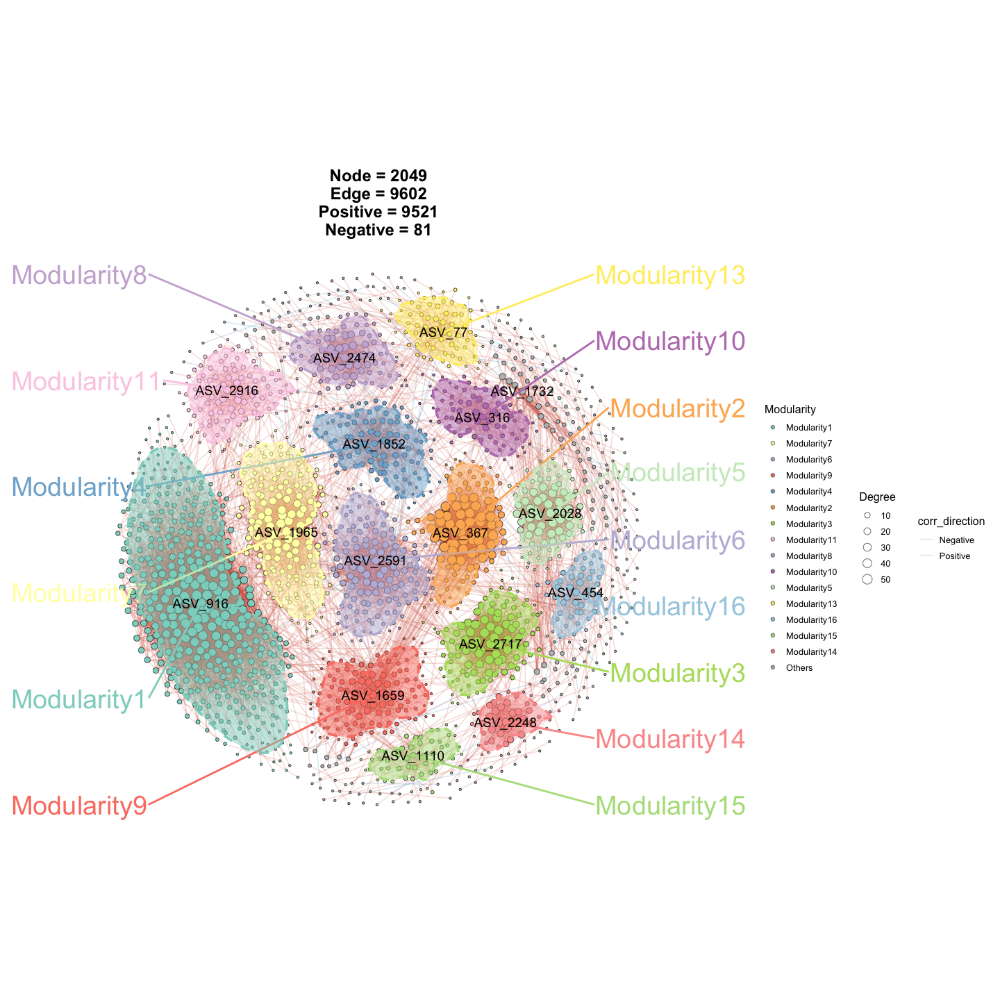
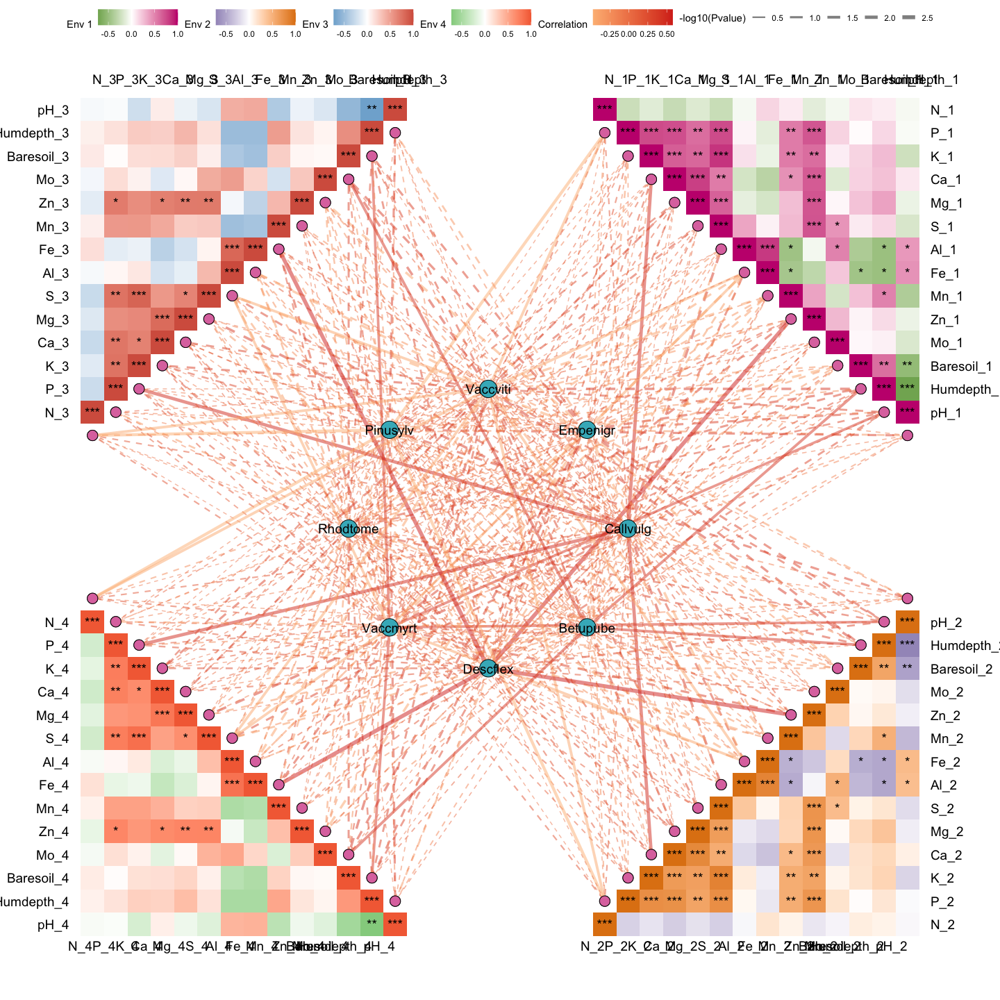

<!-- README_bilingual.md — Chinese + English version, rendered on the Home tab. -->

# ggNetView 

**EN.** ggNetView is an R package for network analysis and visualization.
It provides flexible and publication-ready tools for exploring complex
biological and ecological networks.

**中.** ggNetView 是一个用于网络分析与可视化的 R 包，
为复杂的生物 / 生态网络提供灵活、出版级别的探索工具。

</br>

## Installation · 安装

**EN.** Install the development version from GitHub:

**中.** 从 GitHub 安装开发版本：

``` r
# install.packages("devtools")
devtools::install_github("Jiawang1209/ggNetView")
```

---

## Example 1 · 示例 1

### Step 1 · 第一步: load ggNetView · 加载包

**EN.** Load the package together with ggplot2 and ggnewscale.

**中.** 同时加载 ggplot2 和 ggnewscale。

``` r
library(ggplot2)
library(ggnewscale)
library(ggNetView)
```

### Step 2 · 第二步: load data · 加载数据

**EN.** ggNetView ships several built-in matrices. The raw OTU counts:

**中.** ggNetView 自带若干示例矩阵，这是原始 OTU 丰度表：

``` r
data("otu_tab")
otu_tab[1:5, 1:5]
#>        KO1  KO2  KO3  KO4  KO5
#> ASV_1 1113 1968  816 1372 1062
#> ASV_2 1922 1227 2355 2218 2885
#> ASV_3  568  460  899  902 1226
#> ASV_4 1433  400  535  759 1287
#> ASV_6  882  673  819  888 1475
```

**EN.** Or the rarefied / relative-abundance variants:

**中.** 或者抽平后的相对丰度矩阵：

``` r
data("otu_rare_relative")
otu_rare_relative[1:5, 1:5]
```

**EN.** The taxonomy annotation table — note that its `OTUID` column is **not** used as row names:

**中.** 物种注释表 —— 注意它的 `OTUID` 列**没有**作为行名：

``` r
data("tax_tab")
tax_tab[1:5, 1:5]
#> # A tibble: 5 × 5
#>   OTUID  Kingdom  Phylum          Class          Order
#>   <chr>  <chr>    <chr>           <chr>          <chr>
#> 1 ASV_2  Archaea  Thaumarchaeota  Unassigned     Nitrososphaerales
#> 2 ASV_3  Bacteria Verrucomicrobia Spartobacteria Unassigned
#> 3 ASV_31 Bacteria Actinobacteria  Actinobacteria Actinomycetales
#> 4 ASV_27 Archaea  Thaumarchaeota  Unassigned     Nitrososphaerales
#> 5 ASV_9  Bacteria Unassigned      Unassigned     Unassigned
```

### Step 3 · 第三步: build a graph object · 构建网络对象

**EN.** `build_graph_from_mat()` infers a network from a numeric matrix using
WGCNA / SparCC / SpiecEasi / cor / Hmisc.

**中.** `build_graph_from_mat()` 通过 WGCNA / SparCC / SpiecEasi / cor / Hmisc
从一个数值矩阵推断一张网络。

``` r
obj <- build_graph_from_mat(
  mat              = otu_rare_relative,
  transfrom.method = "none",
  method           = "WGCNA",
  cor.method       = "pearson",
  proc             = "BH",
  r.threshold      = 0.7,
  p.threshold      = 0.05,
  node_annotation  = tax_tab
)
obj
#> # A tbl_graph: 2049 nodes and 9602 edges
```

### Step 4 · 第四步: plot with ggNetView · 用 ggNetView 出图

**EN.** A basic, publication-ready network plot:

**中.** 一张基本的、出版级别的网络图：

``` r
p1 <- ggNetView(
  graph_obj    = obj,
  layout       = "gephi",
  layout.module= "adjacent",
  group.by     = "Modularity",
  fill.by      = "Modularity",
  pointsize    = c(1, 5),
  center       = FALSE,
  jitter       = FALSE,
  mapping_line = FALSE,
  shrink       = 0.9,
  linealpha    = 0.2,
  linecolor    = "#d9d9d9"
)
p1
```



**EN.** Add an outer ring and module labels:

**中.** 加上模块外框与标签：

``` r
p2 <- ggNetView(
  graph_obj    = obj,
  layout       = "gephi",
  layout.module= "adjacent",
  group.by     = "Modularity",
  fill.by      = "Modularity",
  pointsize    = c(1, 5),
  jitter       = TRUE,
  jitter_sd    = 0.15,
  mapping_line = TRUE,
  shrink       = 0.9,
  linealpha    = 0.2,
  linecolor    = "#d9d9d9",
  add_outer    = TRUE,
  label        = TRUE
)
p2
```



**EN.** Recolor nodes by Phylum:

**中.** 按 Phylum 给节点重新上色：

``` r
p3 <- ggNetView(
  graph_obj  = obj,
  layout     = "gephi",
  group.by   = "Modularity",
  fill.by    = "Phylum",
  add_outer  = TRUE,
  label      = TRUE
)
p3
```



**EN.** Highlight the top-degree node in every module via `pointlabel = "top1"`:

**中.** 用 `pointlabel = "top1"` 标出每个模块度最高的节点：

``` r
p5 <- ggNetView(
  graph_obj   = obj,
  layout      = "gephi",
  group.by    = "Modularity",
  fill.by     = "Modularity",
  add_outer   = TRUE,
  label       = TRUE,
  pointlabel  = "top1"
)
p5
```



---

## Example 2 · 示例 2

### Subgraph by module · 取出某一模块子图

**EN.** Pull out the largest module's subgraph:

**中.** 提取出最大的模块对应的子图：

``` r
Sub_module_1 <- get_subgraph(graph_obj = obj, select_module = "1")
names(Sub_module_1)
#> [1] "sub_graph_all"  "stat_module"  "sub_graph_select"
```

---

## Example 3 · 示例 3

### Env-Spec linkage heatmap · 环境-物种关联热图

**EN.** Use `gglink_heatmaps()` to combine multiple environment blocks with a
central species network through correlation or Mantel.

**中.** 用 `gglink_heatmaps()` 把多个环境因子块通过相关或 Mantel 与中心物种网络
连接起来：

``` r
out1 <- gglink_heatmaps(
  env             = Envdf_4st,
  spec            = Spedf,
  env_select      = list(Env01 = 1:14,
                         Env02 = 15:28,
                         Env03 = 29:42,
                         Env04 = 43:56),
  spec_select     = list(Spec01 = 1:8),
  relation_method = "correlation",
  spec_layout     = "circle_outline",
  cor.method      = "pearson",
  r               = 6,
  distance        = 1,
  orientation     = c("top_right", "bottom_right",
                      "top_left",  "bottom_left")
)
out1[[1]]
```



---

## Citation · 引用

**EN.** If you use ggNetView in your research, please cite:

**中.** 如果你在研究中使用了 ggNetView，请引用：

```
Yue Liu, Chao Wang (2026). ggNetView: An R Package for Reproducible and
Deterministic Network Analysis and Visualization.
```

## Links · 资源链接

- GitHub: <https://github.com/Jiawang1209/ggNetView>
- Manual: <https://jiawang1209.github.io/ggNetView-manual/>
- Issues: <https://github.com/Jiawang1209/ggNetView/issues>

<h4 align="center">© 微信公众号 RPython</h4>
